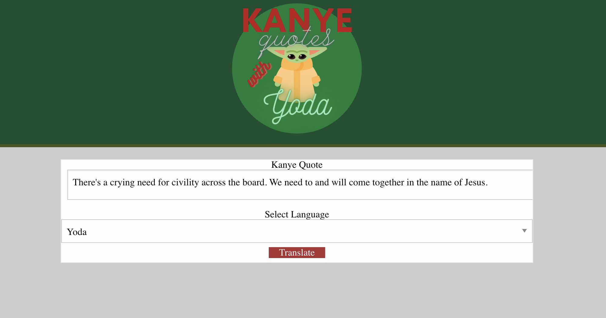

# Project One

<!-- TABLE OF CONTENTS -->
<details open="open">
  <summary>Table of Contents</summary>
  <ol>
    <li>
      <a href="#about-the-project">About The Project</a>
      <ul>
        <li><a href="#built-with">Built With</a></li>
      </ul>
    </li>
    <li>
      <a href="#getting-started">Getting Started</a>
    </li>
    <li><a href="#code-snippet">Code-Snippet</a></li>
    <li><a href="#license">License</a></li>
    <li><a href="#contact">Contact</a></li>
    <li><a href="#acknowledgements">Acknowledgements</a></li>
  </ol>
</details>


<!-- ABOUT THE PROJECT -->
## About The Project



For this project, we decided on creating a webpage that would display a random quote from Kanye West and you would then have the option of translating it into Yoda. There are different animations and with rounded-corners, it makes the webpage more fun and kid friendly to a certain degree... we can't control what Kanye has to say. It tested all of our previous knowledge and we were constantly researching to ensure we had the best product we could deliver to the user!

The websites we used to help create our project are listed below in the <a href="#acknowledgements">acknowledgements</a>.

### Built With

We used <a href="https://code.visualstudio.com/">Visual Studio Code</a> to create the HTML, CSS and Javascript from scratch. We had the help of Foundation for formatting the HTML and JQuery to help with the coding on the Javascript!


<!-- GETTING STARTED -->
## Getting Started

When loading this webpage, you are greeted with several animations and a quote from the one and only, Kanye. The user has the option of what language to have translated and when 'translate' is clicked a pop-up screen is presented with the translated quote and a text reader. The webpage is simple and fun, which is your favorite quote?


<!-- USAGE EXAMPLES -->
## Code Snippet

While coding this weather dashbaord, this piece of code / function proved to be the hardest to figure out. I had to create different variables that would all go into one '$' and creating an 'img' tag was the hardest. It was the hardest because my webpage would display the link rather than the icon and i was through trial and error, I found out the correct formation. This part of the javascript wasn't easy but it was fun because of the challenge!
```
var cityN = city.toUpperCase()
var date = new Date(response.dt*1000).toLocaleDateString();
var icon = response.weather[0].icon;
var iconImage = ""
$(".city-name").html(" " + cityN + " (" + date + ") " + iconImage)
```


<!-- LICENSE -->
## License

Distributed under the MIT License. See `LICENSE` for more information.


<!-- CONTACT -->
## Collaborators
Sami Khawja: [GitHub](https://github.com/samikhawja)

Matt Weichel: [GitHub](https://github.com/maweiche)

Tony Zhang: [GitHub](https://github.com/tonyzyt9947)

Leo Gutierrez: [GitHub](https://github.com/leog888)


## Project Links
Project Link: [GitHub](https://github.com/samikhawja/project_one)

Live Link: [Project One](https://samikhawja.github.io/project_one/)


<!-- ACKNOWLEDGEMENTS -->
## Acknowledgements
* [W3Schools](https://www.w3schools.com/)
* [StackOverflow](https://stackoverflow.com/)
* [Mozilla](https://developer.mozilla.org/en-US/docs/Web/JavaScript)
* [Foundation](https://get.foundation/)
* [JQuery](https://jquery.com/)